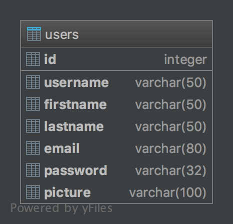
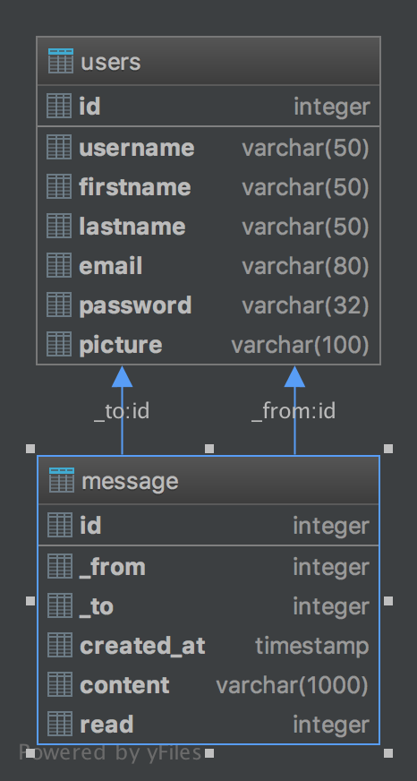
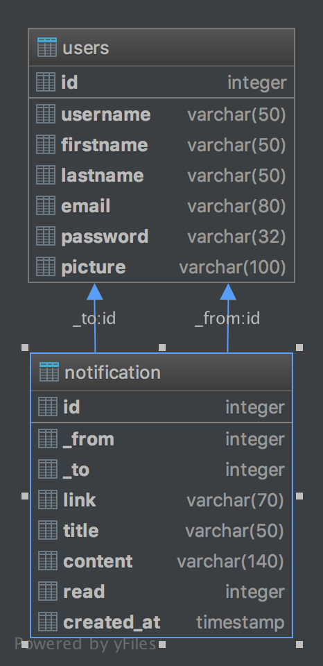
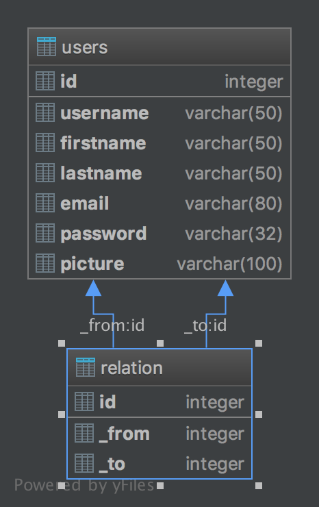

Parts Implemented by Kadir Emre Oto
=====================================

================================
1. User Model
================================

.. autoclass:: cookbook.models.Users
    :member-order: bysource
    :members:
    :private-members:
    :undoc-members:

================================
2. Message Model
================================

.. autoclass:: cookbook.models.Message
    :member-order: bysource
    :members:
    :private-members:
    :undoc-members:

================================
3. Notification Model
================================

.. autoclass:: cookbook.models.Notification
    :member-order: bysource
    :members:
    :private-members:
    :undoc-members:

================================
4. Relation Model (Many to Many)
================================

.. autoclass:: cookbook.models.Relation
    :member-order: bysource
    :members:
    :private-members:
    :undoc-members:
