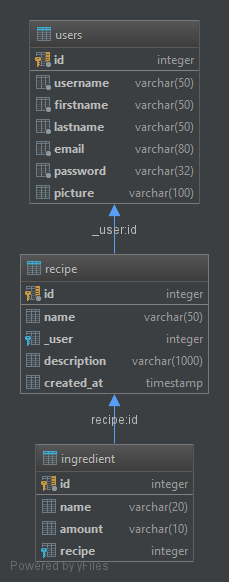

Parts Implemented by Süheyl Emre Karabela
==========================================

**Models are used to represent the tables in the database as python classes.**

Recipe
-------

Recipe table represents a recipe in the database.

.. figure:: img/recipe.png
   :scale: 100 %

.. autoclass:: cookbook.models.Recipe
    :member-order: bysource
    :members:
    :private-members:
    :undoc-members:

Ingredient
----------

Ingredient table represents an ingredient in the database.

.. autoclass:: cookbook.models.Ingredient
    :member-order: bysource
    :members:
    :private-members:
    :undoc-members:

Comment
--------

Comment table represents a comment in the database.

.. autoclass:: cookbook.models.Comment
    :member-order: bysource
    :members:
    :private-members:
    :undoc-members:
