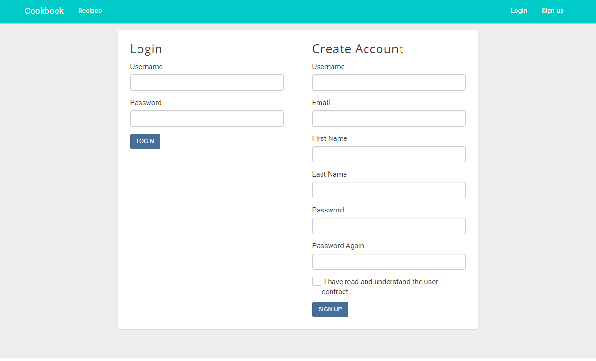
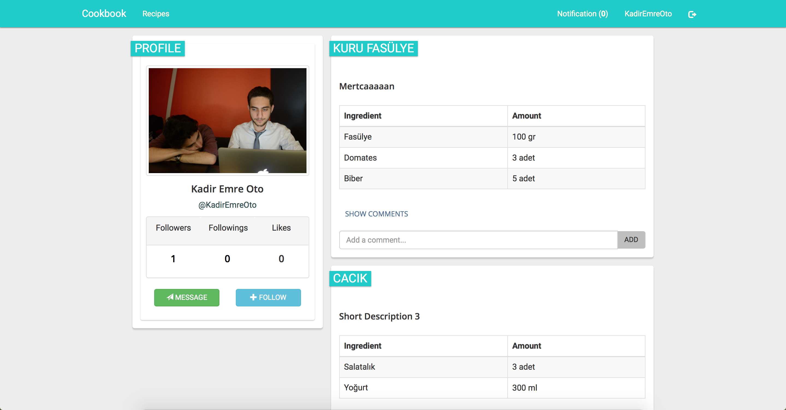
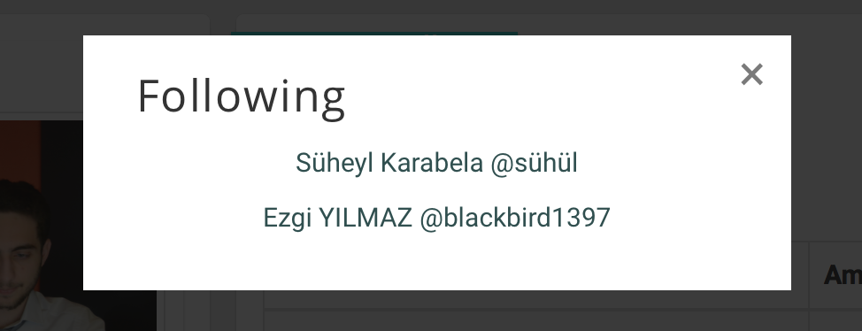
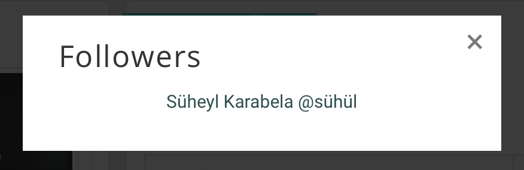
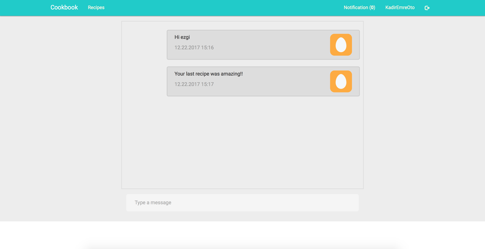
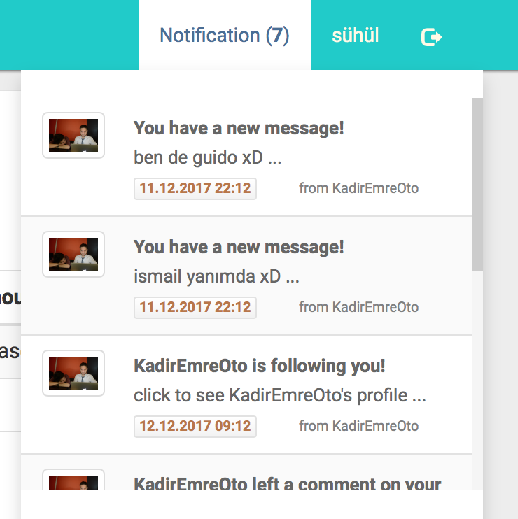

Parts Implemented by Kadir Emre Oto
================================

================
1. Login - Register Page
================

Cookbook is an end-user based website, and all pages except this page are required to login.

Users can perform sign-in and sign-up operations in this page.

|

After loggining or registration, you will be directed to your profile page.

================
2. Profile Page
================

On the left side of this page, there are some information about user.
On the right side, all recipes that user have will be listed.

^^^^^^^^^^^^^^^^^^
2.1. Following Modal
^^^^^^^^^^^^^^^^^^
To see the following relations of user, you should click the following count on the profile page.

^^^^^^^^^^^^^^^^^^
2.2. Follower Modal
^^^^^^^^^^^^^^^^^^
To see the follower relations of user, you should click the follower count on the profile page.

================
3. Message Page
================
Users can send messages each other. When you click the message button on the profile page, you will be redirected to the message page you want to send a message.

================
4. Notification Dropdown Menu
================
* When you recieve a new message
* When someone comments on your recipe
* When someone is starting to follow you

You will be notified! All notifications will be listed on notification dropdown menu.

