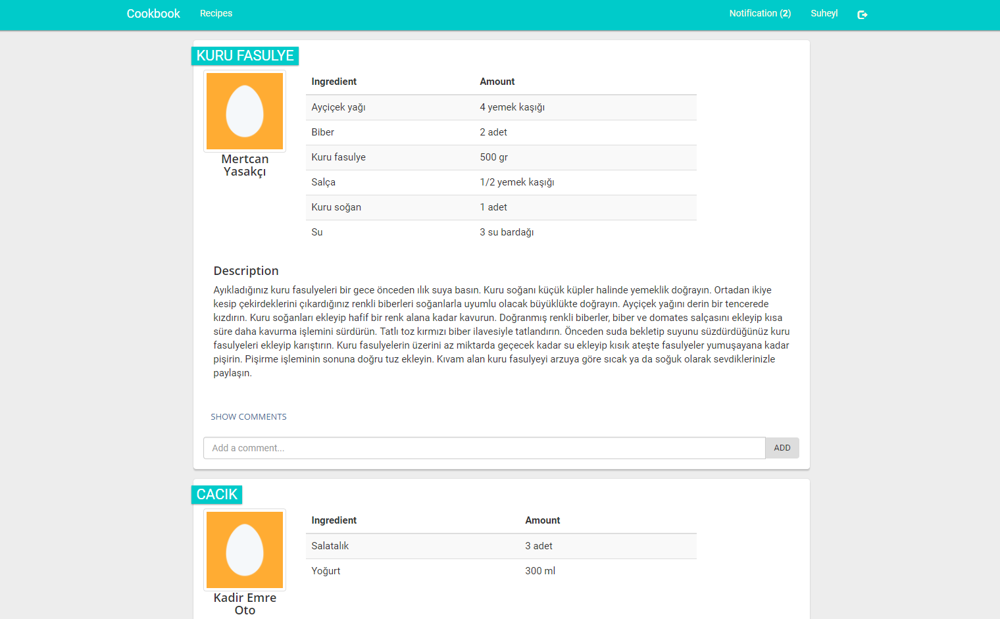
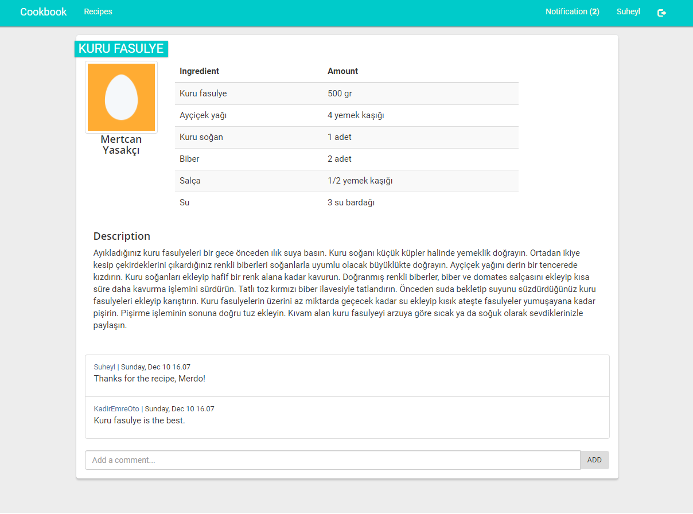
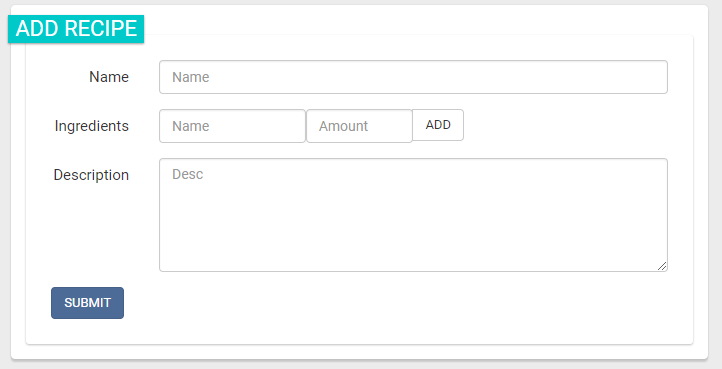
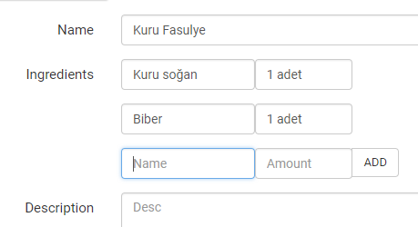
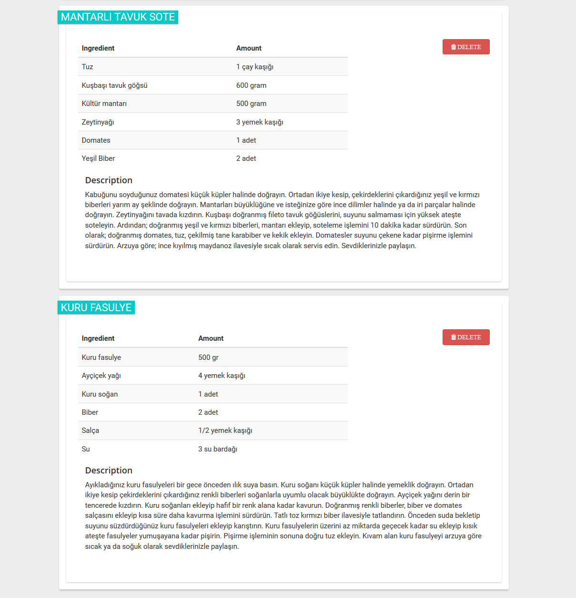
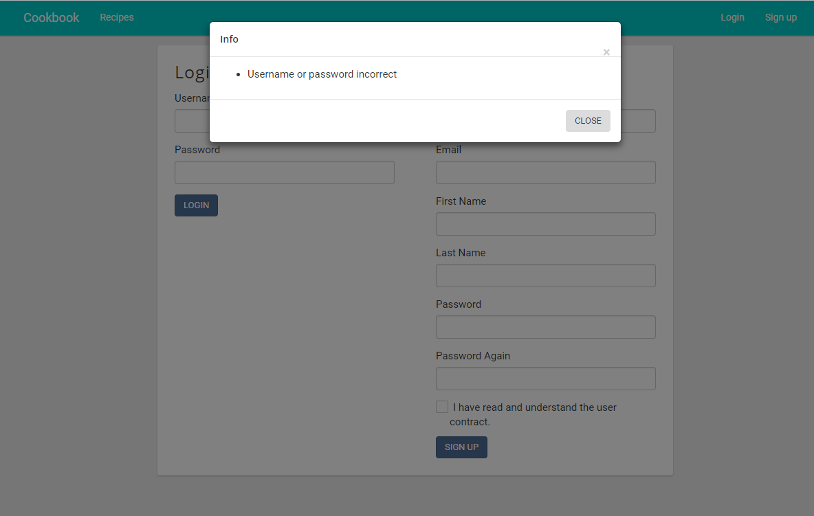

Parts Implemented by Süheyl Emre Karabela
================================

================
1. Home Page
================

Recipes of the user's followings are listed as a timeline in the home page.

|

From the home page, user can go to the individual pages of the recipe by clicking the recipe name or
they can add comments to a recipe.

================
2. Recipe Pages
================

There are 2 pages for recipe:

* Singe Recipe
* My Recipes

^^^^^^^^^^^^^^^^^^
2.1. Single Recipe
^^^^^^^^^^^^^^^^^^
Shows a single recipe with its comments, the URL of the recipe can be shared.

^^^^^^^^^^^^^^^^^^
2.2. My Recipes
^^^^^^^^^^^^^^^^^^
Users can see, add or delete recipes from this page.

Users can add a new recipe from the form on the top of the page.

    `Recipe adding form`

In the adding form, arbitrary number of ingredients can be added.

    `Add button can be used to add ingredients`

Below the recipe form, recipes of the user is listed. Recipes can be deleted with the delete button.

================
3. Flash modal
================

For sending single-time messages to users like form validation errors or information, a popup
modal is used.

